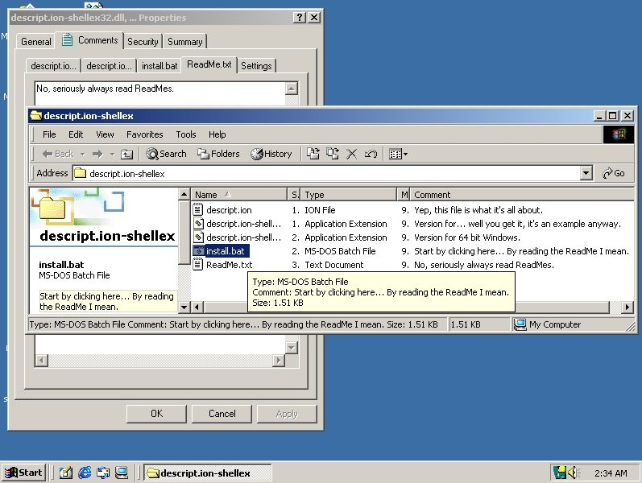

# descript.ion-shellex
This is a windows explorer extension that adds ability to read and edit comments in descript.ion format similar to Total Commander, Double Commander, Far Manager, etc.
It adds corresponding tab in file's properties, and on, pre Vista, Windows NT there also exists a column with the comments, which unfortunately is not really feasible after changes Vista introduced.

## Installation
After building release build go to installer folder and run:

	install.bat

or download a ready build from [release page](https://github.com/residen73vil/descript.ion-shellex/releases/latest) and run install.bat there.

### By hand
You can move the dll to a folder of your chose (windows folder is recommended) and run:

	rundll32 descript.ion-shellex.dll,install

or a standard regsvr32:

	regsvr32 descript.ion-shellex.dll

it would not create an uninstaller item in Programs And Components though.

### Really by hand:
Move descript.ion-shellex.dll into a convenient folder and add following keys to registry:

Register class:

	HKEY_CLASSES_ROOT\CLSID\{5629ff98-e953-466d-8480-3dd3c554ab09} = descript.ion-shellex.dll
	HKEY_CLASSES_ROOT\CLSID\{5629ff98-e953-466d-8480-3dd3c554ab09}\InProcServer32 = %file_path%\descript.ion-shellex.dll
	HKEY_CLASSES_ROOT\CLSID\{5629ff98-e953-466d-8480-3dd3c554ab09}\InProcServer32\ThreadingModel = Apartment

Add property sheet handler:

	HKEY_CLASSES_ROOT\*\shellex\PropertySheetHandlers\descript.ion-shellex = {5629ff98-e953-466d-8480-3dd3c554ab09}
	HKEY_CLASSES_ROOT\Directory\shellex\PropertySheetHandlers\descript.ion-shellex = {5629ff98-e953-466d-8480-3dd3c554ab09}

Add column handler:

	HKEY_CLASSES_ROOT\*\shellex\ColumnHandlers\descript.ion-shellex = {5629ff98-e953-466d-8480-3dd3c554ab09}
	HKEY_CLASSES_ROOT\Directory\shellex\ColumnHandlers\descript.ion-shellex = {5629ff98-e953-466d-8480-3dd3c554ab09}

Settings are saved in HKEY_CURRENT_USER\SOFTWARE\ResE\descript.ion-shellex need you delete them.

## Building and testing
Targets MSVC2005 for better compatibility with older systems, should also build fine in later versions and earlier once if you install win2000 SDK.
Mingw should work too, but support was dropped due to bulky runtime requirement.

#### Build in MSVC2005:
Firstly load the environment using:

	msvc_path\VC\vcvarsall.bat" amd64

or

	msvc_path\VC\vcvarsall.bat" x86

for 32bit build.

Then run:

	nmake ARCH=x64 BUILD=release

or

	nmake ARCH=x86 BUILD=release

Don't forget to clean before each build:

	nmake clean

"nmake defaults to "nmake ARCH=x86 BUILD=debug"
Release build moves the dll to installer folder and adds architecture postfix.

So to make a release build you should run:

	nmake clean
	nmake ARCH=x64 BUILD=release
	nmake clean
	nmake ARCH=x64 BUILD=release

Then rename installer folder, zip it and ship it.

### Testing
Some tests may be found in  :file_folder:*tests* folder.

## Goals for now are:

1. Refactor code.
2. Make it run on win 98, win 95 if possible.
3. Multi language support

## Known issues:

- New file creation is not really robust.
- There is a chance for bugs in new line detection in some codepages.
